# PowerShell

I have completed the PowerShell course on TryHackMe . I learned various PowerShell commands, including how to check for user accounts, collect basic networking details, manage scheduled tasks, and write scripts. I am currently documenting my learning.

PowerShell is a scripting language and shell environment for Windows, developed on the .NET framework. It allows users to automate and manage various tasks through cmdlets — specialized commands that follow a verb-noun format, such as Get-Process.

## Task2 Correct Answer
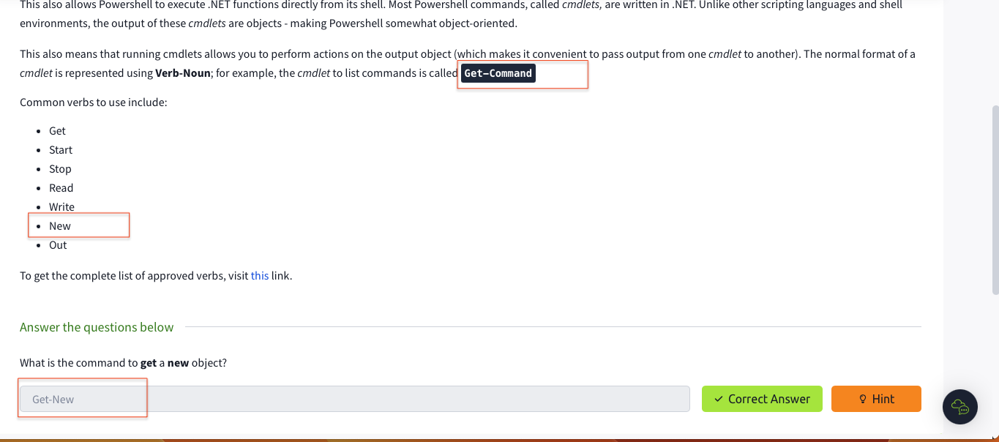

## Task3-1
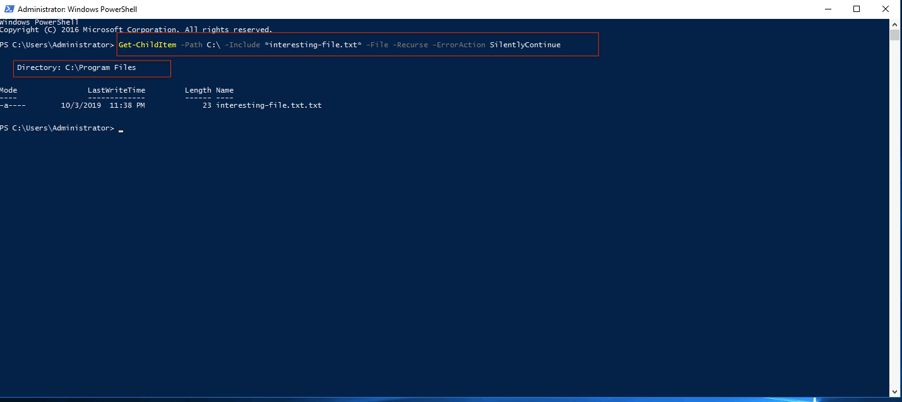

## Task3-2
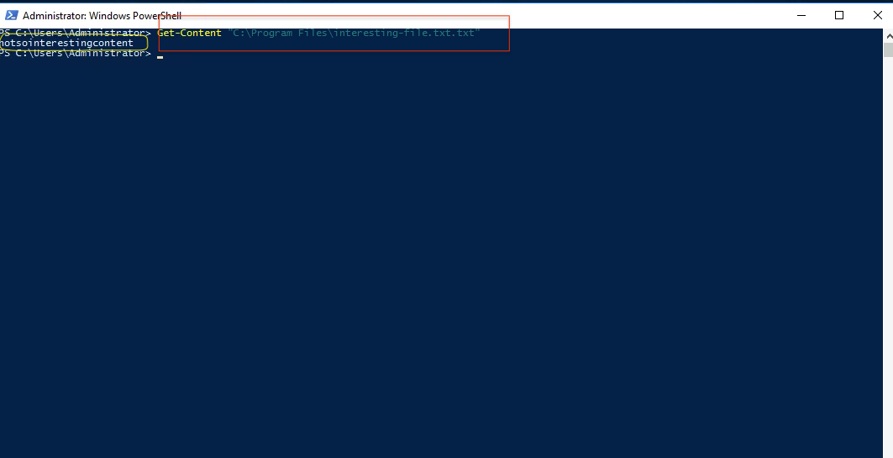

## Task3-3
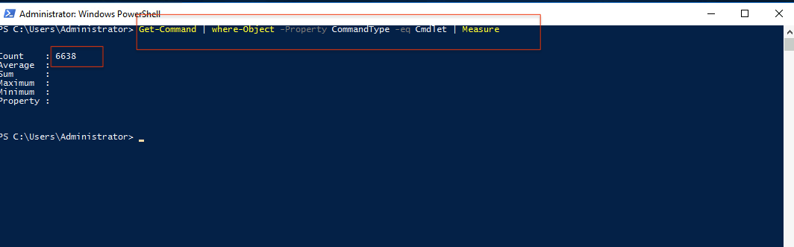

## Task3-4
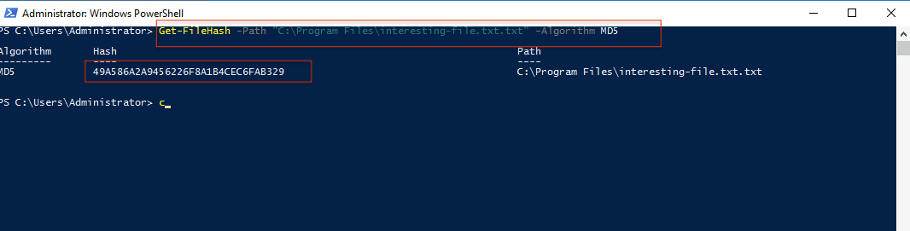

## Task3-5
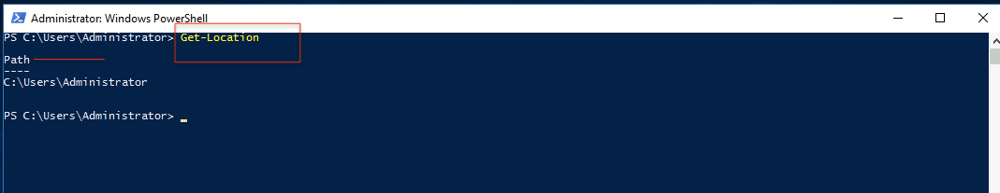

## Task3-6
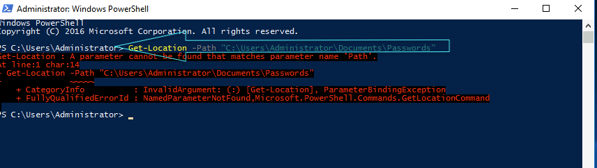

## Task3-7

## Task3-8
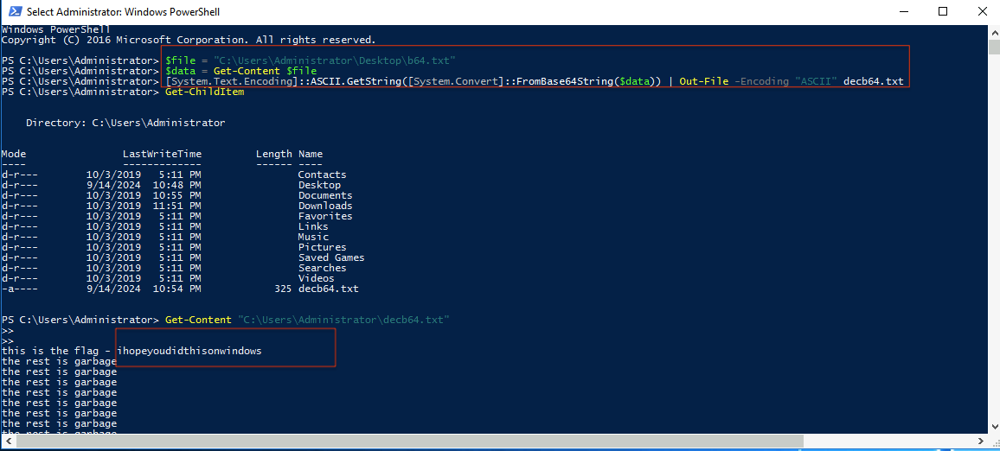

## Task3 Correct Answer
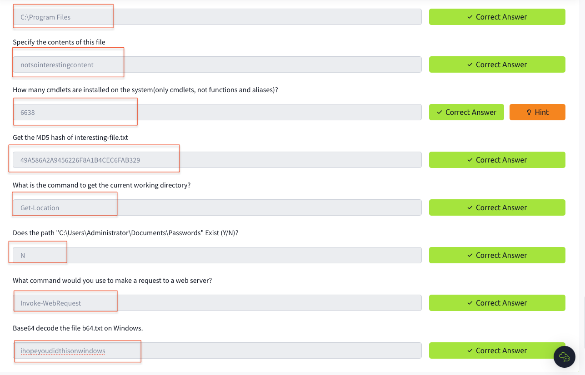

## Task4-1
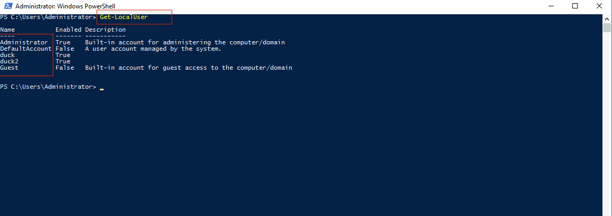

## Task4-2
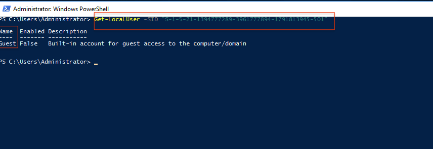

## Task4-3

## Task4-4
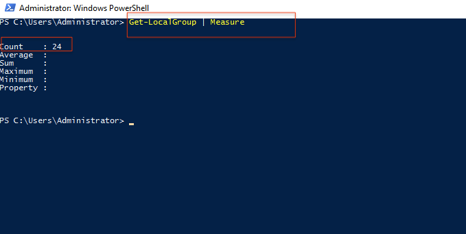

## Task4-5
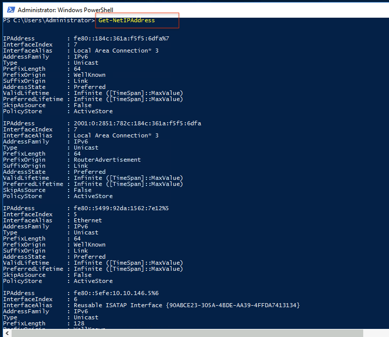

## Task4-6
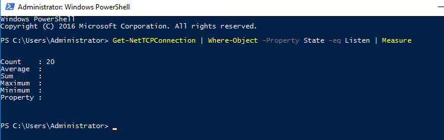

## Task4-7
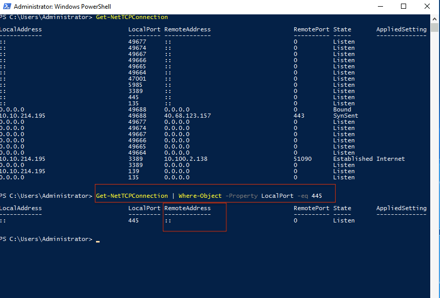

## Task4-8
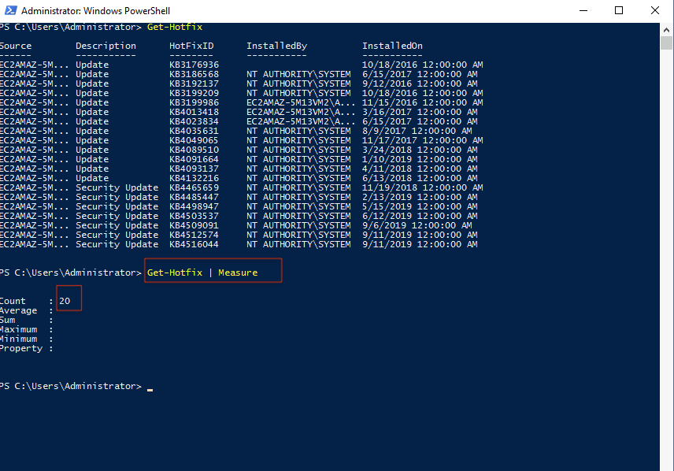

## Task4-9
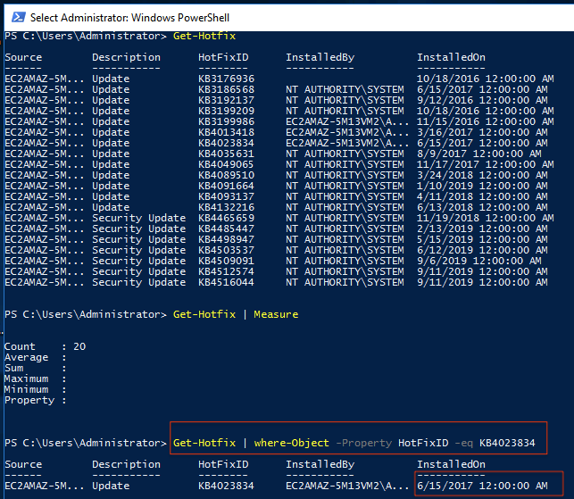

## Task4-12
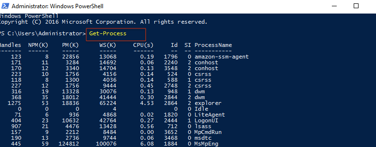

## Task4-13
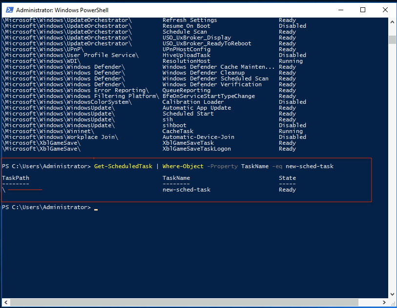

## Task4-14
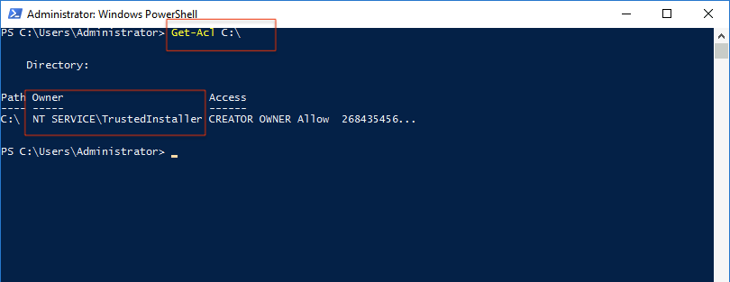

## Task4 CorrectAnswer Part1
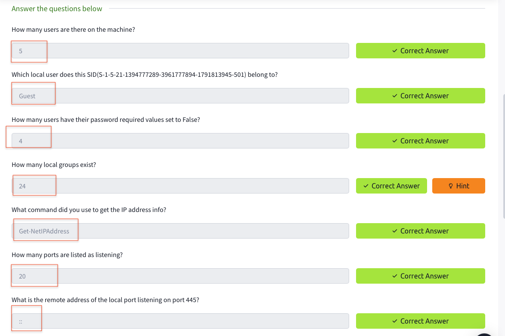

## Task4 Correct Answer Part-2.png

## Task5-1
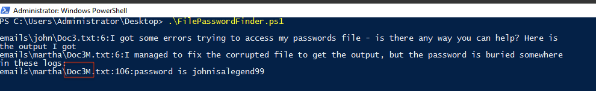

## Task5-2
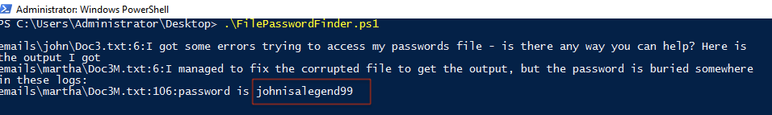

## Task5-3
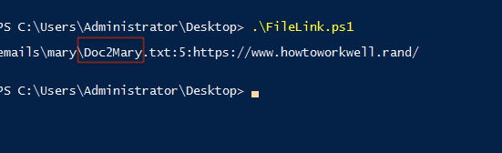

## Task5 CorrectAnswer 
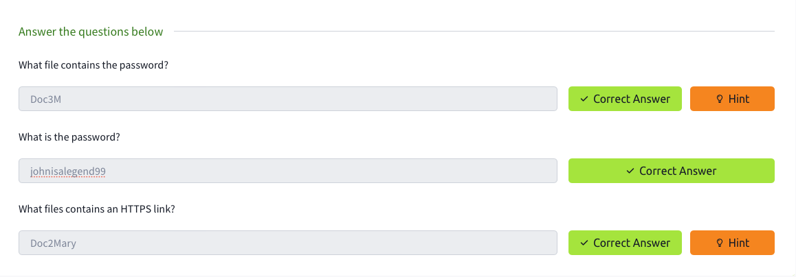

## Task6
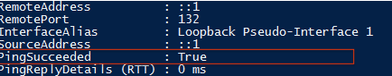

## Task6 Correct Answer
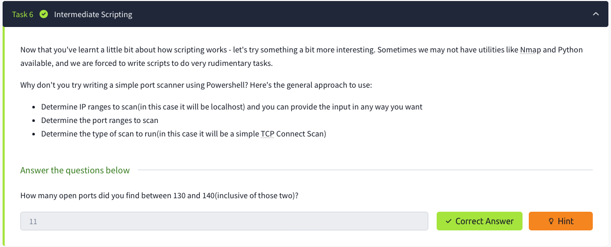

## All Task completed
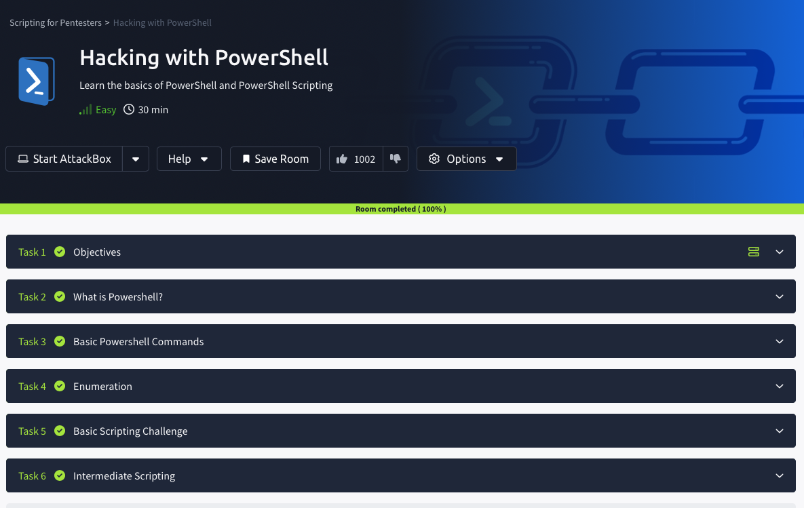

