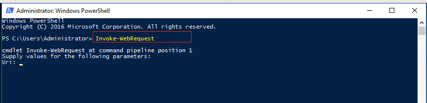
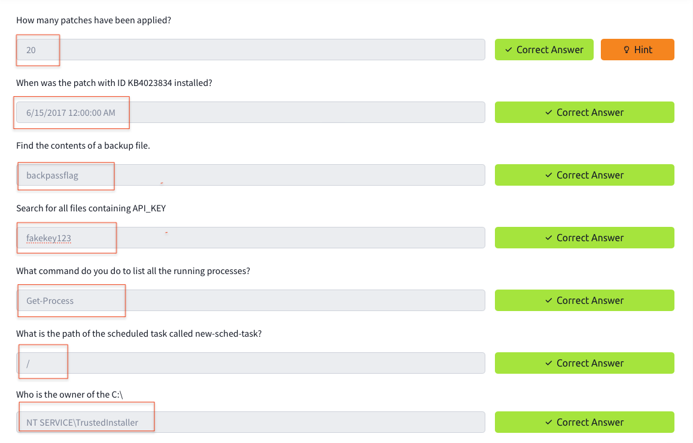

# PowerShell

I have completed the PowerShell course on TryHackMe . I learned various PowerShell commands, including how to check for user accounts, collect basic networking details, manage scheduled tasks, and write scripts. I am currently documenting my learning.

PowerShell is a scripting language and shell environment for Windows, developed on the .NET framework. It allows users to automate and manage various tasks through cmdlets — specialized commands that follow a verb-noun format, such as Get-Process.

## Task2 Correct Answer

## Task3-1

## Task3-2

## Task3-3

## Task3-4

## Task3-5

## Task3-6

## Task3-7

## Task3-8

## Task3 Correct Answer

## Task4-1

## Task4-2

## Task4-3

## Task4-4

## Task4-5

## Task4-6

## Task4-7

## Task4-8

## Task4-9

## Task4-12

## Task4-13

## Task4-14

## Task4 CorrectAnswer Part1

## Task4 Correct Answer Part-2.png

## Task5-1

## Task5-2

## Task5-3

## Task5 CorrectAnswer 

## Task6

## Task6 Correct Answer

## All Task completed

